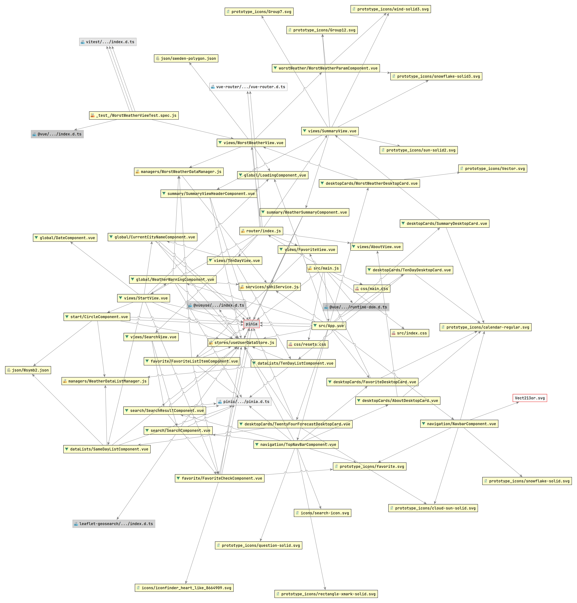
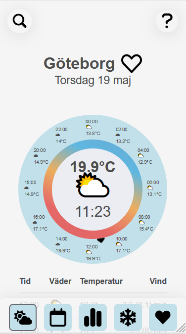
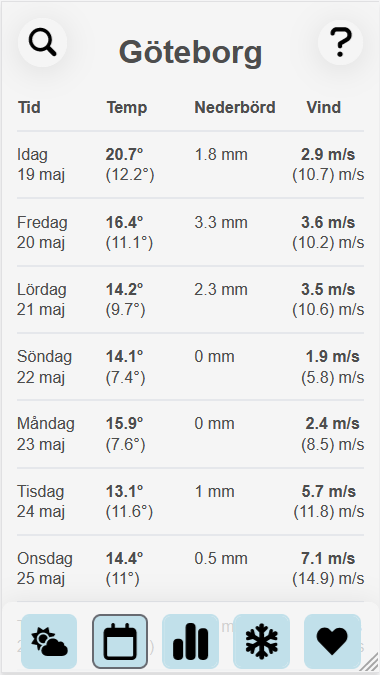
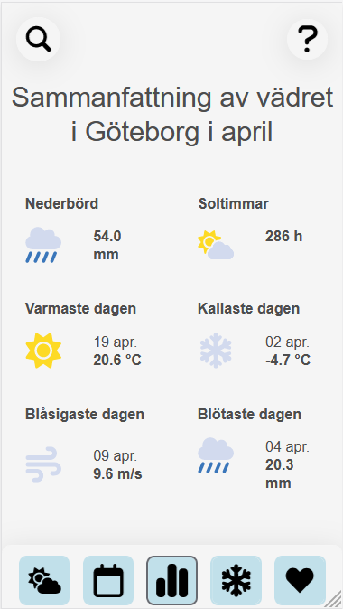
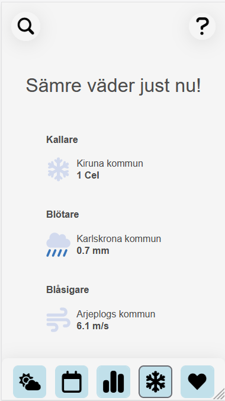
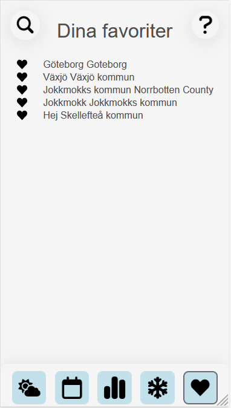
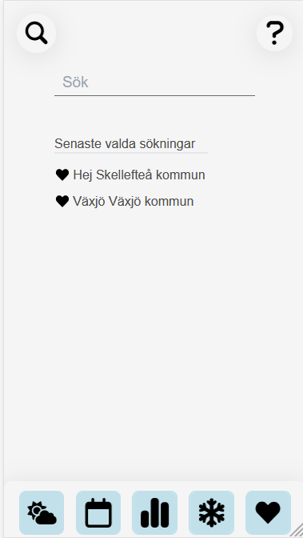
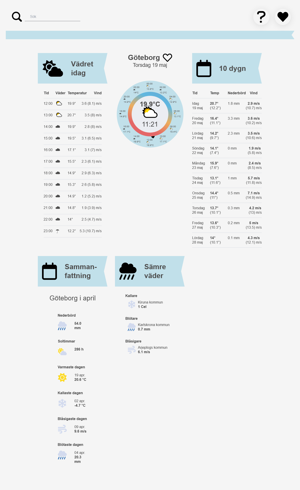
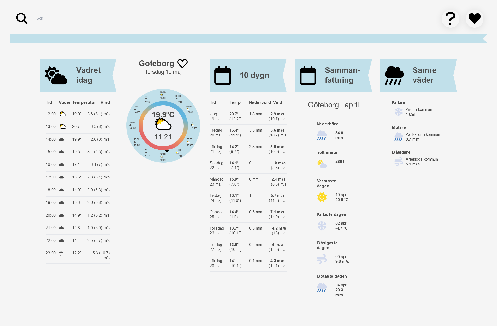
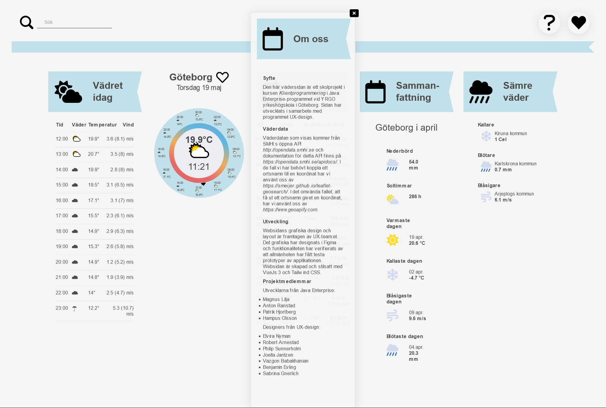

# Java-UX-grupp5 @ YRGO

## Description

A site for displaying the current weather of the users location as well as an option to search for other locations and
see its weather data.

The site has the current weather for today, it also has the weather forecast for the coming 10 days, a summary of the
last months weather for the selected location and a page showing the worst weather in sweden right now.

The webapp uses data from SMHI (Sveriges meteorologiska och hydrologiska institut / Swedish Meteorological and
Hydrological Institute ) open API. More info about that can be found here: https://opendata.smhi.se/apidocs/

It can be found live at:
https://jx-smhi.netlify.app/

## Purpose

A single page web application created as a school project together with UX-design students. Focus on team work.
Practical developement of single page web application using Vue, Vite and other packages.

## Instructions

Instructions for building and running the project as well as for how to use the website.

### How to build and run

Clone GitHub repository. 

Make sure you have Node.js installed. Otherwise it can be found here:
https://nodejs.org/en/download/

From project folder run 
`npm install `

To run the dev. server run the following command. 
`npm run dev`

### How to use

Intentionally left blank. Not for operational use.

## Dependencies

The project have the following dependencies:

### API dependencies

- **[SMHI Open Data API](https://opendata.smhi.se/apidocs/)**  for weather data
- **[Leaflet-GeoSearch](https://smeijer.github.io/leaflet-geosearch/)**, search for city, obtain coordinates. Used to find nearest SMHI station i princip.
- **[GeoApify](https://www.geoapify.com/)**, used to obtain city from coordinate. Dependenant on a free API key that might expire at some point in the
  future.

### Dev. dependencies

- **[Vite](https://vitejs.dev/)**, bundling, building and running dev environment.
- **[ESLint](https://eslint.org/)**, for better code.
- **[Prettier](https://prettier.io/)**, for prettier code.
- **[Tailwind](https://tailwindcss.com/)**, mainly for simplifying responsiveness but also for easy inline CSS.

### Build dependencies

- VueJS 3, framework for building the application.
- Vue Router, for single page application.
- VueUse, plug-in to Vue to simplify local storage handling.
- Leaflet-GeoSearch, see API dependencies.
- Pinia, for state management.

### Dev. tools

- Git and GitHub for version control.
- VSCode and Webstorm as IDE.
- Netlify for CD for development purposes.
- Discord for communication

## Structure

A brief description on the build structure, important files and functions.

### General

- index.html
- main.js
- **App.vue**,
    - set up. Loads user coordinates, obtains SMHI weather data for the user's location.

Relevant dokumentation för funktioner, komponenter m.m. //t.ex i README~~~~~~
Tänk på att koden kommer att testas genom att klona ert repository (main), byggas och testas enligt era
bygginstruktioner så var tydliga. Inga andra verktyg än Node.js (version 16) skall behövas för att bygga applikationen.

### Routers and Views

- About view
    - Self explanatory
- Favorite view
    - Lists all locations that has been marked as a favorite by the user.
- Search view
    - Allows location search and shows previous search selections.
- Start view
    - The entry point of the web application. Shows the user's location, the current weather for this location, the time
      this weather was observed. - The circle shows this days' weather, observation for even hours passedand forecast
      for even hours to come.
    - The list below the circle shows detailed forecasted weather for the remaining hours of the day.
- Summary view
    - Nederbörd is the accumulated precipitation for current or selected location in the previous month.
    - Soltimmar is the accumulated no of hours of sun for current or selected locaton in the previous month.
    - Varmaste dagen is the warmest temperture observed, together with date, for the current or selected locaton in the
      previous month.
    - Kallaste dagen is the coldest temperature observed, together with date, for the current or selected location in
      the previous month.
    - Blåsigaste dagen is the windiest day (excluding gusts) observed, together with date, for the current or selected
      location in the previous month.
    - Blötaste dagen is the day with the highest preciptation, together with date, for the current or selected location
      in the previous month.
       
    

    Note: For many weather stations complete data for all parameters are missing.
    

- Ten day view
    - Lists the forecasted weather for the coming 10 days for current or selected location.
    - The temperature column shows the maximum and minimum temperature expected for that day.
    - The precipitation column shows the total expected precipitation during that day.
    - The wind column shows the maximum expected mean wind and highest gust in parentheses.
- Worst weather view
    - Shows the location in Sweden with the coldest temperature, the most rain and the highest mean wind. The values
      come from the most recent observation and is a maximum of an hour old.

### Components

#### Global

- **CurrentCityNameComponent**, fetches our current coordinates from our store and uses the GeoAppifyApi to obtain the
  name of the coordinate's location.
- **DateComponent**, obtains today's date and converts it to Swedish format.
- **LoadingComponent**, presents a loading circle while requested methods are working.
- **WeatherWarningComponent**, uses the current coordinates from the store to check if the coordinates are inside a
    weather warning polygon.

#### DataLists

- **SameDayListComponent**, fetches forecast data from our store and uses the WeatherDataManager to create and present a
  list of today's weather.
- **TenDayListComponent**, fetches forecast data from our store and uses the WeatherDataManager to create and present a
  list of the coming 10 days' weather.

#### DesktopCard

A collection of desktop card components to present the different views in cards in desktop mode.

#### Favorite

- **FavoriteCheckComponent**, is used to check and uncheck a location as a favorite. Adds the location to a list of
  favorite locations in our store.
- **FavoriteListItemComponent**, uses the favorite list from our store and presents this list.

#### Navigation

- **NavBarComponent**, presents navigation buttons to the router views of this application. Only visible on mobile.
- **TopNavBarComponent**, a fixed top navigation bar showing links to search and about router.

#### Search

- **SearchComponent**, an input element for searching for location with leaflet-geosearch. Creates search result data
- **SearchResultComponent**, presents a list of the search result data as well as a list of previous search selection
  from our store.

#### Start

- **CircleComponent**, uses analysisFullData and forecastFullData to generate a circle representation of today's
  weather.

#### Summary

- **SummaryViewHeaderComponent**, header component for summary view showing the current selected location city name and
  previous month
- **WeatherSummaryComponent**, takes a parameter for wanted data type, fetches current coordinates from our store, finds
  the nearest avaliable station for chosen parameter and then fetches data from the station for the chosen parameter

#### Worst weather

- **WorstWeatherParamComponent**, takes weather data for a specified parameter and presents it.

#### Managers
- **WeatherDataListManager.js**
  - getListWithWeatherData(), takes data and returns a list based on amount of data points, time interval and what type of list we want.
  - getWeatherDataForDate(), takes data and returns a list of average weather values for a specified date.

- **WorstWeatherDataManager.js**
    - **getMinMaxValCoord()**, takes a parameter and returns an object with the highest value for that parameter and its location
  as well as the lowest value for the parameter and its location
    - **rayCastingAlgorithm()**, algorithm that checks if a given coordinate is inside a given polygon,
  used for specifying our search to only be inside Sweden

#### Services
- **smhiService.js**, service used for fetching data from https://opendata.smhi.se/ with error handling
  
#### Stores/Pinia
- **useUserDataStores.js**, handles state management for coordinates, geolocationdata, weatherdata, searchdata and favoritelocationlist.
Uses VueUse to set some of these state to local storage. 

  
### Assets

- **Main.css**, for our global css

- **Json-files**
  - **sweden-polygon.json**, polygon over Sweden, plotted with 800 coordinate points
  - **Wsymb2.json**, data list to transscribe smhi:s Wsymb2 codes to unicode symbols

## Visual Structure

### Mobile Screenshots

### Desktop Screenshots

